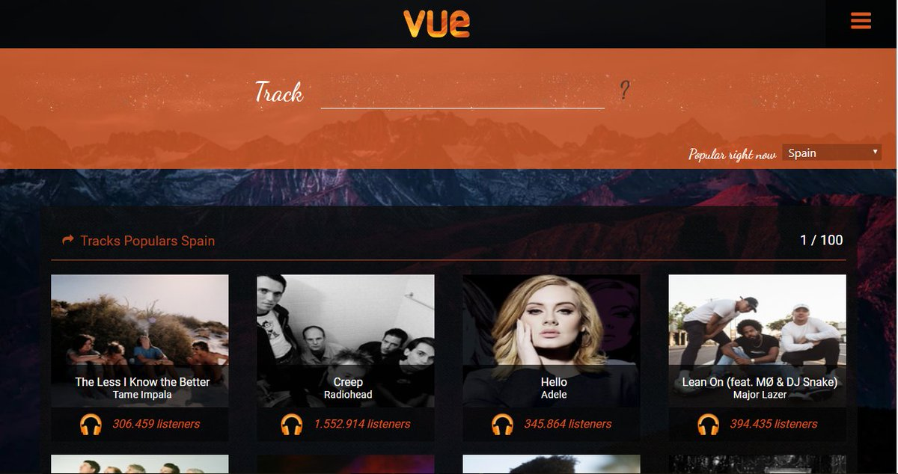

# Client site Portal de musica online

> Este repositorio contiene el Client site de una App sencilla desarrollada con Vue JS para ver los temas más populares asi como los artitas top usando la API de last.fm.



[Ver la aplicación](https://ricrdomedina.github.io/vueMusic/)

## Cómo funciona?

Requiere Node.JS 8

``` bash
# install dependencies
npm install

# serve with hot reload at localhost:8080
npm run dev

# build for production with minification
npm run build
```
## Licencia 

MIT
